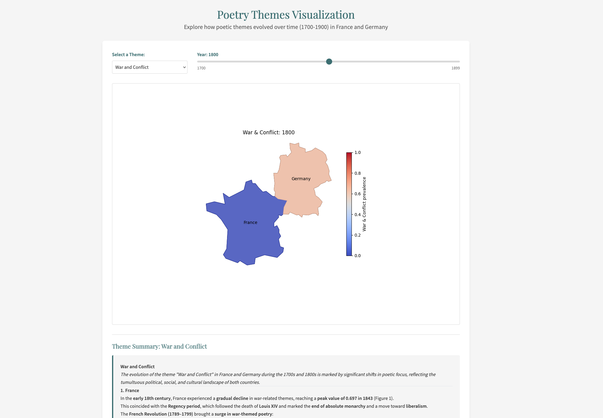

# Poetry Meta-Patterns: Tracking Thematic Evolution Across Time and Space

A data-driven exploration of how poetic themes evolve across time (1700-1900) and geography (France and Germany), visualizing cultural exchanges and thematic shifts in poetry.

[](https://theme-atlas.vercel.app)

## Table of Contents

- [Project Overview](#project-overview)
- [Demo](#demo)
- [Project Structure](#project-structure)
- [Datasets](#datasets)
- [Installation & Setup](#installation--setup)
- [Running the Frontend](#running-the-frontend)
- [Methodology](#methodology)
- [Key Findings](#key-findings)
- [Future Work](#future-work)
- [Video Presentation](#video-presentation)
- [Reports](#reports)
- [Contributors](#contributors)

## Project Overview

This project analyzes and visualizes the spread and evolution of meta-patterns in poetry, particularly thematic elements, across time (1700-1900) and geography (France and Germany). By extracting recurring meta-patterns from diverse poetic corpora, we identify common literary themes and trace their changing prominence over two centuries, revealing both periodic fluctuations and plausible cultural exchanges between French and German literary traditions.

Our interactive visualization tool enables users to:

- Select specific themes from a dropdown menu
- Navigate through time using an interactive year slider (1700-1900)
- View side-by-side comparisons of theme prevalence in France and Germany
- Read historical context about thematic shifts through informative summaries

## Demo

**Live Demo**: [Poetry Meta-Patterns Visualization](https://theme-atlas.vercel.app)

The interactive visualization allows you to:

1. Select a theme from the dropdown
2. Move the year slider to see how the theme's prevalence changed over time
3. View the visualization comparing France and Germany side by side
4. Read historical context in the summary section

## Project Structure

```
poetry_metapatterns/
├── datasets/                  # Raw and processed poetry datasets
│   ├── DLK/                   # German Poetry Corpus
│   ├── gutenberg/             # Gutenberg Poetry Corpus
│   ├── oupoco/                # French Poetry Corpus (Oupoco)
│   ├── poetryfoundation/      # Poetry Foundation dataset
│   ├── combine_datasets.py    # Script to unify datasets
│   ├── global_themes.txt      # List of extracted global themes
│   └── visualization.ipynb    # Analysis and visualization notebook
├── frontend/                  # Vue.js frontend application
│   ├── public/                # Static assets
│   │   └── frames/            # Generated visualization images
│   └── src/                   # Frontend source code
│       ├── components/        # Vue components
│       │   ├── ThemeSelector.vue
│       │   ├── YearSlider.vue
│       │   ├── ThemeVisualization.vue
│       │   └── SummarySection.vue
│       ├── App.vue            # Main application component
│       └── main.js
├── narratives/                # Theme narrative explanations
└── README.md                  # Project documentation
```

## Datasets

This project utilizes poetry from four main sources, combined into a unified dataset:

1. **DLK (Deutsches Lyrik Korpus)** - German Poetry Corpus

   - 22,039 poems
   - Primary source for German poetry analysis

2. **Oupoco** - French Poetry Corpus

   - 4,870 poems
   - Primary source for French poetry analysis

3. **Gutenberg Poetry Corpus**

   - 547 poems (filtered subset)
   - Additional poetry data with temporal metadata

4. **Poetry Foundation**
   - 113 poems
   - Source for theme classifications and additional poetry

### Combined Dataset Structure

The unified dataset includes the following columns:

- `title` - Poem title
- `poet` - Author name
- `poem` - Full poem text
- `language` - Language of the poem
- `location` - Geographic location/country
- `year` - Year of publication
- `theme` - Thematic classification
- `source` - Source dataset

Total dataset size: 27,569 poems

## Installation & Setup

### Prerequisites

- Node.js (v14+)
- Python 3.8+
- pip

### Setup

1. Clone the repository:

```bash
git clone https://github.com/CharlesAverill/poetry_metapatterns.git
cd poetry_metapatterns
```

### Frontend Setup

1. Navigate to the frontend directory:

```bash
cd frontend
```

2. Install Node dependencies:

```bash
npm install
```

## Running the Frontend

1. Navigate to the frontend directory:

```bash
cd frontend
```

2. Start the development server:

```bash
npm run serve
```

3. Open your browser and navigate to:

```
http://localhost:8080
```

To build for production:

```bash
npm run build
```

## Methodology

Our approach involved:

1. **Data Collection & Preprocessing**:

   - Gathering poetry from multiple sources
   - Augmenting with inferred temporal and geographic metadata
   - Standardizing format across datasets

2. **Thematic Analysis**:

   - Using multilingual sentence embeddings from transformer models
   - Extracting common themes across languages without explicit translation
   - Clustering poems based on thematic similarity

3. **Visualization Pipeline**:

   - Measuring relative theme prevalence over time in each country
   - Constructing normalized temporal frequency functions
   - Plotting theme prevalence onto geographic maps

4. **Historical Context**:
   - Developing narrative explanations for major thematic shifts
   - Connecting data trends to historical and cultural events

## Key Findings

Our analysis revealed 15 dominant themes including nature, religion, war, morality, and death. Key findings include:

- Themes like "power" and "freedom" correlate with historical socio-political events
- "Nature" and "romantic love" show lagged influence between countries, suggesting cultural exchange
- "Religion" shows mutual decline in both countries, reflecting shared secularization
- Evidence of cross-border literary influence through thematic patterns

## Future Work

Potential directions for expanding this research:

- Multi-theme analysis for each poem to enhance data granularity
- Integration of economic data (inflation, GDP) to measure external influences
- Analysis of individual poets' thematic development over time
- Expansion to additional languages and wider geographic regions
- Extended temporal coverage beyond 1700-1900

## Video Presentation

[](https://youtu.be/agRr7erBTE4D)

## Reports

- [Proposal](./proposal.pdf)
- [Final Report](./final_report.pdf)

## Contributors

- [**Charles Averill**](https://github.com/CharlesAverill)

- [**Sristi Dakshit**](https://github.com/SristiDakshit)

- [**Joel Stephen**](https://github.com/JoelJacobStephen)
